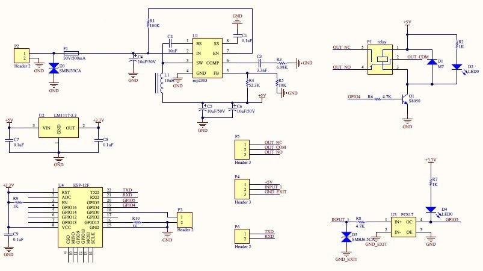

# TelegramOpener
[TelegramOpener для платы реле HW-622 на базе esp8266](https://github.com/SergeyF11/TelegramOpener)

#### Beta version. Release will be soon!!

## Назначение
Данный скетч превращает плату **hw-622** (или любую другую esp8266 12e с реле) в бот для открытия дверей/шлагбаумов/ворот через кнопку в чате или канале Телеграм.

## Прежде чем начать
Создайте Телеграм бота с помощью **@BotFather** и сохраните токен для дальнейшего использования с **TelegramOpener**.

## Принципиальная схема

## Начало
### Прошивка
Загрузите бинарный файл и прошейте его в esp8266 любым удобным способом.

- с помощью [Flash-ESP8266-NodeMCU](https://github.com/sreenathbs/Flash-ESP8266-NodeMCU) по адресу 0х0
- с помощью примера беспроводного обновления [ota-basic](https://github.com/esp8266-examples/ota-basic)

Максимально подробное опиание процесса прошивки модуля HW-622 можно найти на [странице](https://community.home-assistant.io/t/hw-622-board-setup-single-relay-single-input-opto-isolated-esp8266-esp-12f-3-80aud/391116).

>**Note:** для первоначальной прошивки потребуется адаптер USB-UART подключение его к плате hw-622 тремя проводами rx-tx,tx-rx,gnd-gnd к терминалу **P6**. При прошивке должна быть установлена перемычка **P3** и подано питание на плату.

>**Note:** *Если у вас нет адаптера и/или вы не готовы прошивать самостоятельно, то обратитесь к автору.*

>*Возможна компиляция и прошивка скетча через Arduino IDE или другие ИДЕ для опытных пользователей. См. Compiling.md для подробностей.*

>**Warning:** Поздравляю!! У вас появилась плата HW-622 с прошивкой **TelegramOpener**

#### Перейдите к [Инструкции пользователя](docs/UserGuide_rus.md) для настройки бота 
