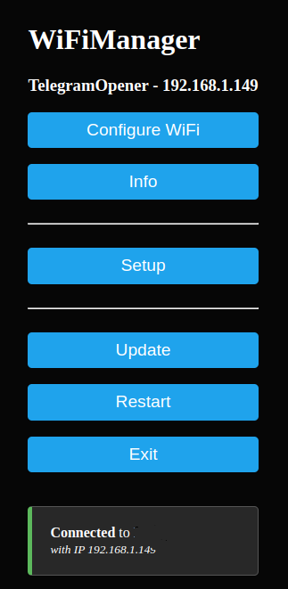
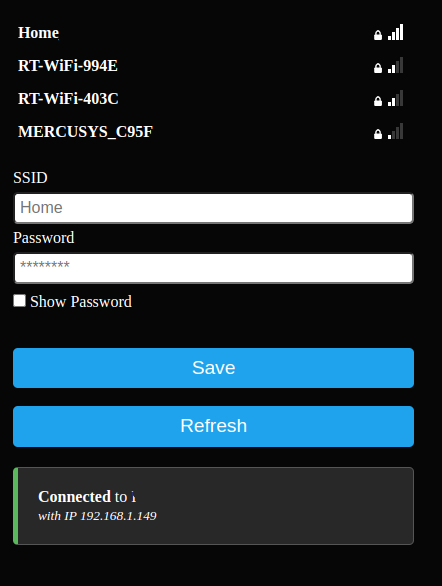
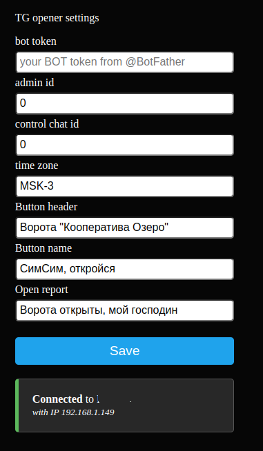

# TelegramOpener
[TelegramOpener для платы реле HW-622 на базе esp8266](https://github.com/SergeyF11/TelegramOpener)

#### Beta version. Release will be soon!!

## Инструкция пользователя

### Назначение
Бот **TelegramOpener** предназнаен для открытия дверей/шлагбаумов/ворот (далее просто **ворота**) через кнопку в чате или канале Телеграм. Вы можете пользоваться им индивидуально или через открытый или закрытый канал Телеграмм. В случае использования закрытого канала вы сами определяете кто сможет воспользоваться ботом для открытия ворот. Воспользоваться кнопкой смогут только авторизованные пользователи канала.

### Первоначальная настройка 
Убедитесь, что перемычка **P3** не установлена (пины не замкнуты). Подайте питание +7-24В на разъем **P2**. 
>**Внимание!!** На плате нет защиты от неправильной полярности. **-** питание подключается ближе к терминалу **P6**.

Включите смартфон и найдите сеть wifi с именем **TelegramOpener-XXXXX**. Подключитесь к ней с паролем **12345678** и войдите в портал настроек. 

Нажмите **Configure WiFi** и выберите сеть wifi для дальнейшей работы **TelegramOpener** и введите пароль к этой сети wifi. Сохраните настройки сети. 

Вернитесь назад и перейдите в пункт **Setup** и вставьте там полученный токен бота. 
>*Note: Настоятельно рекомендуется не вводить токен с клавиатуры, а скопировать его из чата __@BotFather__ и вставить во избежании ошибок ввода!*
Пункты **admin id** и **control chat id** рекомендуется оставить в значении **0** во избежании ошибок ввода. В дальнейшем **TelegramOpener** сам настроит правильные значения для них. При желании ведите свою временную зону в формате Linux (*например для Москвы: __MSK-3__ или __GMT+3__*) или сдвиг в часах (*-3*). Остальные пункты можно оставить без изменений или настроить на своё усмотрение. Сохраните настройки. 

Вернитесь назад и перезагрузите **TelegramOpener** выбрав пункт **Restart**.

### Первый запуск и возможные проблемы
Плата должна перезагрузиться. Синий светодиод на плате esp должен сначала загореться и, при успешном соединении с сетью и подключении к Телеграмм, начать кратковременно мигать один раз в секунду. При невозможности подключиться к сети wifi **TelegramOpener** снова запустит портал настроек, в этом случае светодиод будет гореть синим. Перейдите к предыдущему пункту и выполните настройки заново.

При неправильном введении токена бота и/или отсутствии выхода в интернет у выбранной сети wifi **TelegramOpener** не сможет подключится к Телеграм, что выразиться частым миганием синего светодиода. 
Если вы ошиблись при вводе токена, то запустить портал настроек можно следующим образом:
 - снимите питание с платы
 - установите перемычку на пины **rx** и **gnd** терминала **P6**
 - подайте питание на плату
 - исправьте настройки и сохраните их
 - выйдите из портала настроек
 >*Note: Не забудьте снять перемычку после окончания настройки для нормальной работы.*

### Работа с ботом
После успешного подключения **TelegramOpener** к Телеграм, перейдите в чат с вашим ботом и дайте команду **/start** для начала диалога. **TelegramOpener** предложит вам стать Администратором. Согласитесь им стать, чтобы больше никто другой не мог управлять им. 
Как только вы станете Администратором, в чате с ботом появиться клавиатура управления **TelegramOpener** с помощью которой можно управлять реле на плате. При нажатии на кнопку реле будет замыкать нормально открытые контакты терминала **P5** на 3 секунды, что достаточно для работы большинства систем СКУД открытия дверей/шлагбаумов/ворот.

### Предоставление доступа к кнопке другим пользователям
 - Создайте частный канал в Телеграме. 
 - Добавьте своего бота в канал с правами Администратора.
Клавиатура в вашем чате с ботом должна пропасть _(удалите её сами, если она не пропала)_ и должна появиться клавиатура в выбранном канале. Теперь управление реле возможно только из канала.

 - Добавьте в канал пользователем любым способом:
    + с помощью постоянной ссылки
     >*Внимание!!! Постоянную ссылку можно копировать. Если вы хотите добавлять пользователей с подтверждением, то создавайте ссылки-приглашения с соответствующими ограничениями на подключение. В этом случае посторонние не смогут ими воспользоваться.*    
    + с помощью ссылок-приглашений 
    + с помощью платных ссылок-приглашений
  	>*Note: в этом случае пользователь сможет воспользоваться каналом управления только после оплаты и только на оплаченный период времени.*

Вы в любой момент можете удалить бота из канала и перейти к индивидуальному управлению, если потребуется. Таким же образом можно изменить канал управления, при необходимости. **TelegramOpener** не сможет удалить кнопку управления реле из канала, но вы всегда сможете сами удалить её. В любом случае **TelegramOpener** перестанет реагировать на кнопку канал.

>**Внимание!**_Во избежании ложных срабатываний реле кнопка открытия реле выполнена динамической. После длительного отсутствия пользователя в сети Интернет возможна ситуация, когда при нажатии код кнопки не является действительным. В этом случае **TelegramOpener** сообщит о непредвиденной ситуации и попросит повторить нажатие. Это не является неисправностью._

### Настройка работающего **TelegramOpener**
Для настройки рботающего **TelegramOpener** можно воспользоваться командами в личном чате с ботом 
 - **/startWeb** для запуска web-версии настроек без перерыва в работе **TelegramOpener**
 >Внимание! Вход в настройки доступен для всех пользователей активной сети WiFi без авторизации. Сразу после настроек выйдите из них выбрав пункт **Exit** или дав команду боту **/stopWeb**. 
 - **/startPortal** для прекращения обслуживания и запуска портала с собственной сетью WiFi

### Обновление прошивки
 - Для обновления прошивки можно воспользоваться встроенным Web или порталом.
>*Внимание! Обновление из портала не работает. Даже в этом случае нужно зайти в портал через веб-браузер для обновления прошивки.*
 - Через личный чат с ботом - просто пришлите файл с прошивкой *(расширение .bin)* боту.

## ToDo
Сделать Журнал проходов в отдельном канале.
Ввод часового пояса только для этого нужен, собственно

